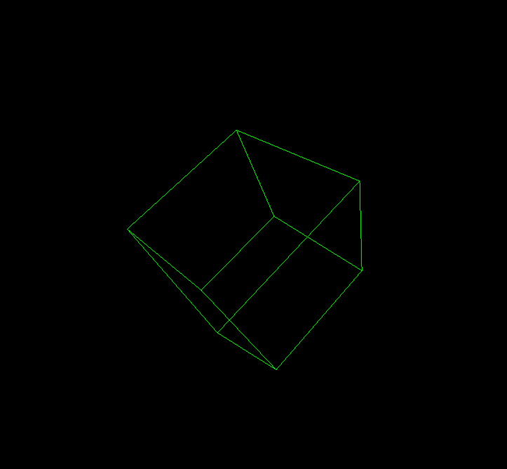

# 3DRenderer

3DRenderer est un petit moteur de rendu 3D filaire écrit en C++ avec SFML.

Le but du projet est de comprendre les bases d'un renderer 3D en construisant les objets, leurs transformations et leur projection à l'écran sans utiliser de moteur 3D existant.



## Fonctionnalites

- Affichage d'objets 3D en wireframe
- Projection simple de points 3D vers l'ecran 2D
- Transformations de base :
  - position
  - rotation
  - mise a l'echelle
- Classe abstraite `Object3D` pour definir une forme 3D
- Formes disponibles :
  - `Cube`
  - `Pyramid`
- Animation par mise a jour a chaque frame
- Affichage avec SFML

## Structure du projet

```text
src/
  core/
    App.hpp / App.cpp
    polygons/
      Object3D.hpp / Object3D.cpp
      Cube.hpp / Cube.cpp
      Pyramid.hpp / Pyramid.cpp
  main/
    main.cpp
res/
  Sansation.ttf
```

## Idee generale

Chaque objet 3D herite de `Object3D`.

Une forme definit :

- ses sommets 3D dans `construct_vertices()`
- ses aretes dans `construct_edges()`
- son comportement dans `update()`

Le moteur projette ensuite les points 3D sur la fenetre SFML et trace les aretes entre les sommets.

## Exemple

```cpp
Cube cube{
  sf::Vector3f{0.f, 0.f, 1.f},
  sf::Vector3f{45.f, 0.f, 45.f},
  sf::Vector3f{0.5f, 0.5f, 0.5f}
};
```

## Compilation

Le projet utilise CMake.

```bash
cmake -S . -B cmake-build-debug
cmake --build cmake-build-debug
```

Puis lancer l'executable genere dans le dossier de build.

## Objectif

Ce projet est avant tout un projet d'apprentissage. Il me permet d'explorer :

- la geometrie 3D
- les rotations et transformations
- la projection perspective
- l'organisation d'un petit projet C++
- l'utilisation de SFML pour dessiner dans une fenetre

## Ameliorations possibles

- Ajouter de nouvelles formes 3D
- Ajouter la possibilité de créer des formes composites
- Ajouter une camera deplacable
- Menu type Unity/UE pour gerer des paramètres en temps réel
- Gerer les faces pleines (Shaders ?)
- Ameliorer la projection et le clipping

## Credits

La base SFML et le projet CMake de l'application ont été récupéré de projets exemples des cours de développement C++ de Michel Simatic à Télécom Sudparis.
